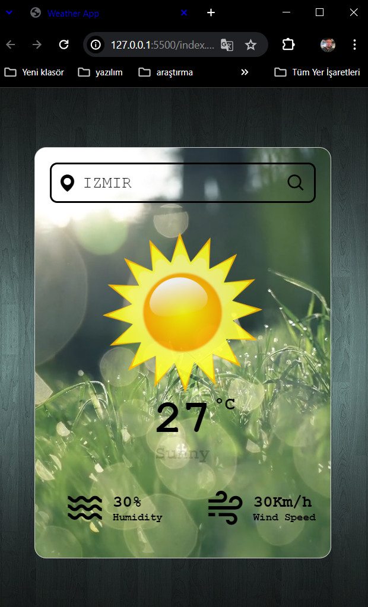
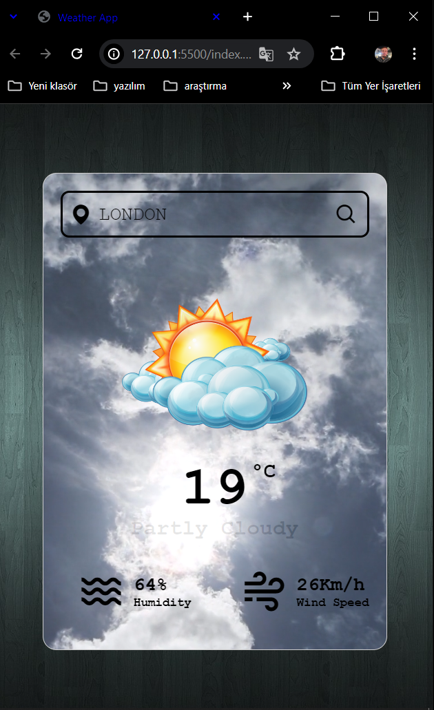

# Simple-Html-Css-Js-Projects

## Hava Durumu Uygulaması

Bu proje, HTML, CSS ve JavaScript kullanılarak geliştirilmiş bir hava durumu uygulamasıdır. Ayrıca, hava durumu verilerini almak için bir API kullanılmıştır.

## Ekran Görüntüsü

        
